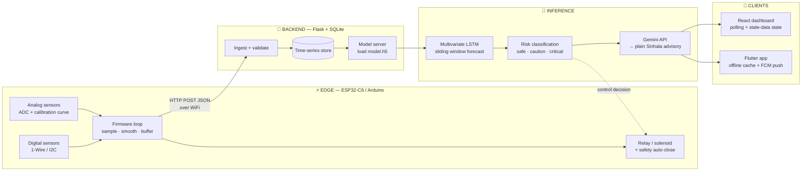

<!--
════════════════════════════════════════════════════════════
  GITHUB PROFILE README
  ──────────────────────────────────────────────────────────
  SETUP: Find & replace  YOUR-USERNAME  with your GitHub
  handle (it appears in the stats cards + links below).
  Then put this file in a repo named exactly like your
  username, e.g.  github.com/YOUR-USERNAME/YOUR-USERNAME
════════════════════════════════════════════════════════════
-->

<div align="center">


<br/>

<a href="mailto:your.email@example.com"></a>
<a href="https://linkedin.com/in/YOUR-LINKEDIN"></a>


</div>

---

## 🌊 About Me

```yaml
name:       Weenuka
location:   Sri Lanka 🇱🇰
role:       Undergraduate · Embedded + ML systems engineer
domain:     Environmental sensing, agriculture, low-resource NLP
stack:      ESP32/C++ → Flask/Python → TensorFlow → React + Flutter
interests:  Time-series forecasting, sensor fusion, edge/cloud split
currently:  Multivariate LSTMs on noisy, gap-filled field telemetry
```

I build **closed-loop systems**: firmware that samples the physical world, a model that turns that stream into a forecast, and an interface that converts the forecast into an action a non-technical person will actually take. The interesting engineering is rarely the model — it's everything around it. Clock drift, sensor fouling, dropped WiFi packets, ADC non-linearity, and what the system should do when the network is gone for six hours.

---

## 🏗️ System Architecture I Build



**The design principle:** every layer must degrade gracefully. Firmware buffers when the backend is unreachable, the dashboard visibly marks stale data rather than showing a confident stale number, and actuators fail *closed* on a hardware timer that doesn't depend on the network being alive.

---

## 🛠️ Technical Stack

<div align="center">

**Languages**


**ML / Data**


**Architectures & Techniques**

`LSTM / sequence forecasting` · `Siamese networks` · `YOLO object detection` · `CNN transfer learning`
`K-Means · AGNES · DBSCAN` · `Sensor fusion` · `Digital signal processing` · `Time-series resampling`

**Web / Mobile / Backend**


**Embedded & Protocols**


`I²C` · `1-Wire` · `UART` · `ADC / analog calibration` · `PWM` · `HTTP/REST` · `Relay & solenoid control`

</div>

---

## 🚀 Featured Projects

<table>
<tr>
<td width="50%" valign="top">

### 🐟 AquaSense
**Predictive water-quality monitoring for aquaculture**

Four-layer architecture — **SENSE → PREDICT → ADVISE → ACT**. ESP32 samples pH, turbidity and temperature; a multivariate LSTM forecasts the trajectory of water conditions *hours ahead* rather than firing a threshold alarm after the damage is done. Predictions are classified into risk bands and passed to Gemini, which renders them as plain Sinhala advisory text for farmers.

**Engineering focus:** sensor anomaly detection that distinguishes a genuine water event from a fouled or drifting probe; weather API data as an exogenous LSTM input; relay-driven aerator/pump control loop; predator detection (birds, monitor lizards) via pretrained CV models on a second above-water camera.

`ESP32` `Keras LSTM` `Gemini API` `OpenCV` `React` `Flask`

</td>
<td width="50%" valign="top">

### 🌱 RootWatch
**Closed-loop irrigation & plant health system**

ESP32-C6 on the Arduino framework reading a **DS18B20** over 1-Wire, a **capacitive soil moisture probe on GPIO3 (ADC1)** with a calibrated dry/wet range, an LDR for light and a TCS3200 for leaf-colour tracking — rendered locally on an SSD1306 I²C OLED and POSTed as JSON to a Flask API.

**Engineering focus:** a 12V NC solenoid switched through a 5V relay on an isolated supply, with a **firmware-level auto-close safety timer** so a crashed backend can't flood a field. One Flask backend serves two clients (React + Flutter); the mobile app caches last-known readings for offline field use and receives FCM push alerts. Trained LSTM is exported as `model.h5` and served from the backend.

`ESP32-C6` `TensorFlow` `Flask` `SQLite` `React` `Flutter`

</td>
</tr>
<tr>
<td width="50%" valign="top">

### 🔍 Spot the Difference
**Deep learning change detection**

Detects and localises visual differences between two similar images or video frames, for surveillance, industrial quality inspection and frame-by-frame film comparison.

**Engineering focus:** a comparative study of three approaches — **YOLO-based detection** on the difference signal, **ResNet Siamese networks** learning a similarity embedding, and **EfficientNet** backbones — evaluated on localisation accuracy versus inference cost. The core problem is separating semantic change from nuisance variation: lighting shifts, compression artefacts and sub-pixel misalignment.

`PyTorch` `YOLO` `Siamese ResNet` `EfficientNet` `OpenCV`

</td>
<td width="50%" valign="top">

### 🗣️ සිංහල කාර්යාල සහායක
**Sinhala speech → formal office documents**

A Flutter app that captures spoken Sinhala and generates correctly structured official Sinhala documents through the Gemini API.

**Engineering focus:** working in a **low-resource language** where off-the-shelf STT and formatting assumptions break down — Sinhala script rendering and font fallback on Android, prompt design that enforces formal register and fixed document structure rather than conversational output, and handling the gap between colloquial spoken Sinhala and formal written form.

`Flutter` `Dart` `Gemini API` `Speech-to-Text` `Unicode Sinhala`

</td>
</tr>
<tr>
<td width="50%" valign="top">

### 🎙️ Vocal Enhancer
**Real-time voice DSP engine**

A low-latency audio processing desktop app written in pure Python — no DAW, no plugin host.

**Engineering focus:** a real-time callback-driven DSP chain (`sounddevice`) running noise gate → **custom YIN-based pitch detection and correction** → harmony generation → compressor → 3-band EQ → creative FX (robot, delay, reverb), built to hold a stable buffer without dropouts. Also supports offline file rendering and preset recall.

`Python` `PySide6` `NumPy/SciPy` `sounddevice` `YIN` `DSP`

</td>
<td width="50%" valign="top">

### 🎪 EventScout AI
**Event infrastructure & vendor-bidding marketplace**

A two-sided marketplace matching event organisers with vendors through a structured bidding flow, built for the Algostrom Idealize Ideathon.

**Engineering focus:** relational schema design for a bidding lifecycle in PostgreSQL, an Express REST layer, and Gemini-assisted requirement matching — plus a hand-built design system (defined palette and type scale) rather than assembling stock components.

`React` `Vite` `Tailwind` `Node.js` `Express` `PostgreSQL` `Gemini API`

</td>
</tr>
</table>

---

## 🔧 Engineering Notes

Problems I've actually had to solve, rather than tutorials I've followed:

| Problem | Approach |
|---|---|
| **Analog sensor reading wrong** | Capacitive soil probe gave a compressed range — traced to supply voltage vs ESP32 ADC reference mismatch; fixed with a corrected supply and a re-derived dry/wet calibration curve |
| **Threshold alarms fire too late** | Replaced reactive thresholding with a sequence model that forecasts the trend, so an alert arrives with usable lead time |
| **Real event vs broken sensor** | Anomaly detection layer that checks physical plausibility and cross-sensor consistency before trusting a reading |
| **Actuator safety without network** | Auto-close timer implemented in firmware, not in the backend — the valve closes even if the server dies mid-cycle |
| **Two clients, one API** | Single Flask contract consumed by React and Flutter; mobile caches last-known state so the field view still works offline |
| **Stale data looks like live data** | Explicit freshness state in the UI driven by last-report timestamp, never an implicit assumption that the newest row is current |
| **ML output that no one acts on** | Model output converted into plain-language Sinhala guidance via Gemini, so the end user gets an instruction, not a number |

**Workflow:** separate repos per component (firmware / backend / web / mobile), each documenting its role in the system contract.

---

## 📊 GitHub Stats

<div align="center">


<br/><br/>


<br/><br/>


</div>

---

## 🎯 Currently Working On

- 🔭 **AquaSense** — actuator control loop, sensor fault detection, and weather data as an exogenous forecasting input
- 🌾 **RootWatch** — full vertical build: firmware → Flask API → LSTM serving → React dashboard → Flutter app → FCM alerts
- 🧠 Deeper into **multivariate time-series forecasting** and **change-detection architectures**
- 🌏 Making model output genuinely usable in **Sinhala** — generated in the language, not translated into it

---

<div align="center">

### 💬 Let's build something

If you work on embedded systems, applied ML, or agri-tech — I'd like to talk.

<a href="mailto:your.email@example.com"></a>

<br/><br/>

*"The best system is the one a farmer actually opens on their phone."*


</div>
